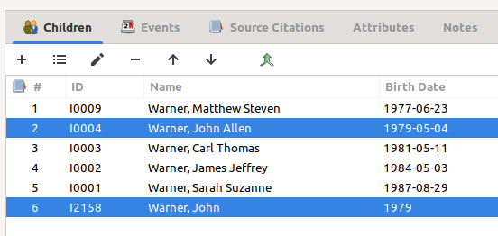
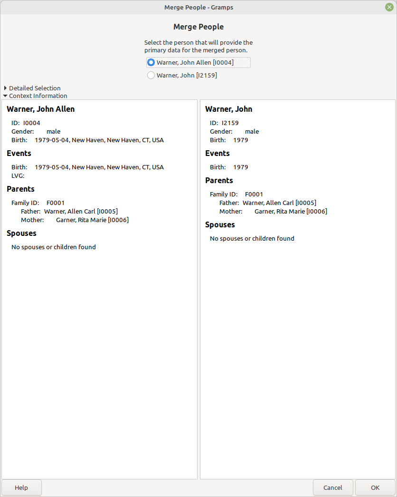
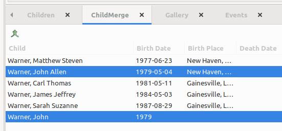

ChildMerge
----------

Author: kari.kujansuu@gmail.com 
10 Feb 2025

Sometimes there are duplicate people as children of a family. This can happen e.g. when you merge two family trees together and they contain common families. After merging the families you still need to merge the children. This addon tries to help in doing that.

After installing the addon and restarting Gramps the "Children" tab in family editor dialog will contain a new button for merging children. This button is the green merge icon to the right of the other buttons:

In this example there are two children named John and if you know that they are the same person, you can select them and click the merge button. The standard merge People dialog will open:

After the merge the child list will be updated accordingly. Note that you can only merge two people at a time.

The addon also includes a new gramplet the can be placed on the bottom bar of the family view. The gramplet lists the children of the selected family and it also contains the merge button which works in the same way:

This gramplet also adds birth and death places of the children to the list.

