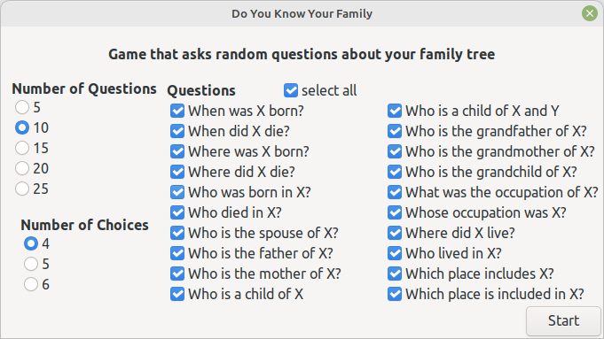
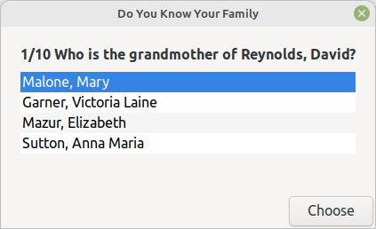
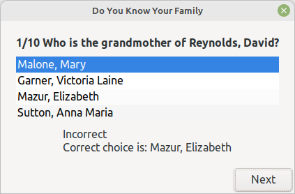
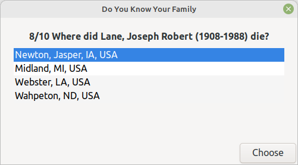
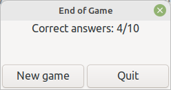

# Do You Know Your Family
v0.9.0 
16 July 2024 
Author: kari.kujansuu@gmail.com 

## Introduction

This is a simple single-user game that tests your knowledge of your family tree by asking random questions about it in Gramps.

Each question has a number of alternative choices and you should choose the correct answer. Only one choice is correct.

At startup the game displays these options. You can choose the number questions asked, the number of choices in each question
and also the types of questions asked:

Do any changes or accept the defaults. The program remembers the choices next time.

Here are a few sample questions. Select your answer and click "Choose". The game shows if the answer was correct or not. Click "Next" for the next question.

Double clicking any alternative opens the corresponding editor in Gramps. This can be used to verify the correct answer, for example. Or possibly fix the database.

After all questions the number of correct answers is shown:

You can play again or quit.

Is this the world's first game within a genealogy application?

## Notes

This game requires that SuperTool is installed (version 1.3.3 or later).

The family tree must contain enough objects for the game to make sense. At least a couple dozen families and people with birth and death dates and places. Best to use an actual realistic family tree.

The questions about occupation assume that the occupation is stored in the description field of an Occupation event.

The questions about where people lived assume that there are corresponding Residence events.

The questions about places including other places assume that the corresponding 'Enclosed by' relations are defined (i.e. a place hierarchy exists).

Sometimes the program may be unable to generate a question. This might be because the family tree is too small or the types of questions are too limited.
