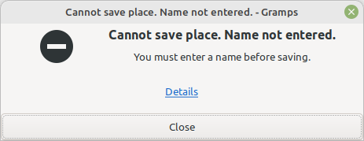
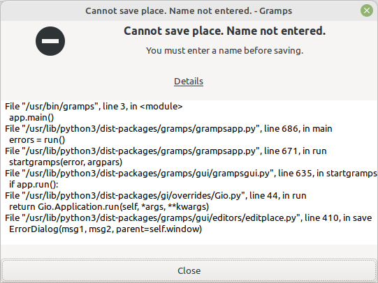

ErrorDetails
------------

Author: kari.kujansuu@gmail.com 
2025

Sometimes Gramps or an addon displays an error dialog but it is not obvious where the error occurred.

This addon adds a "<u>Details</u>" link to all ErrorDialogs. Clicking "Details" will display the stack trace that led to the error. You can copy and paste the text in the stack trace.

A simple example. If a place name is not provided when adding a place you will get this dialog:

Clicking the "Details" link will display the stack trace:

Clicking "Details" again will close the stack trace display.

