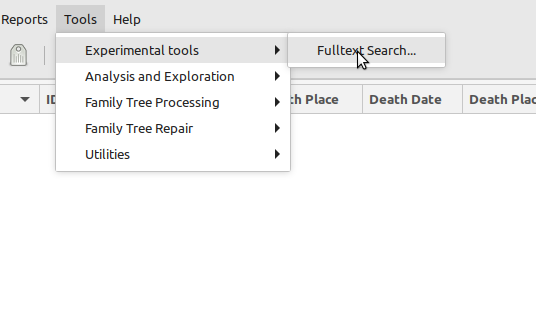
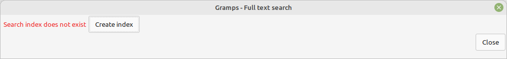
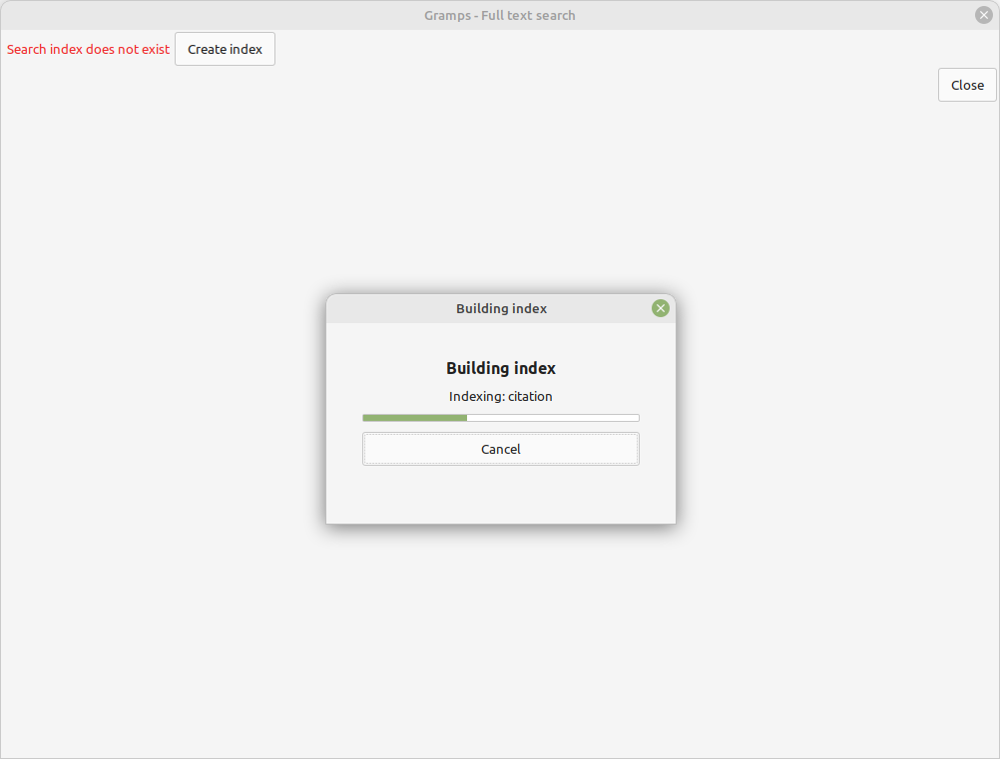
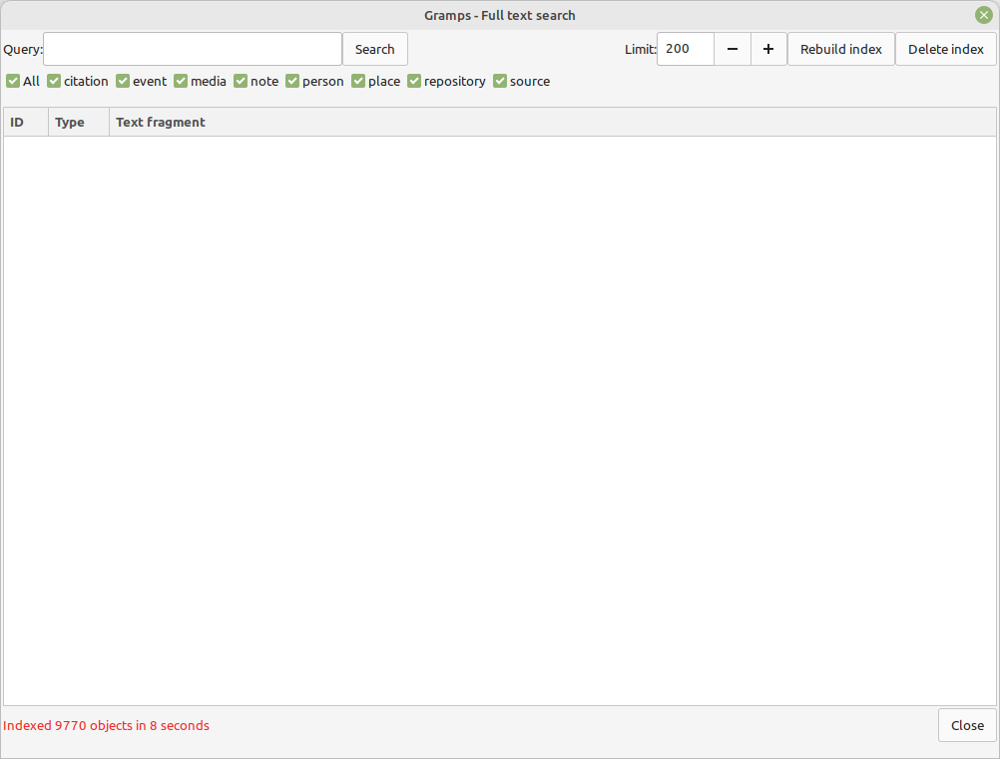
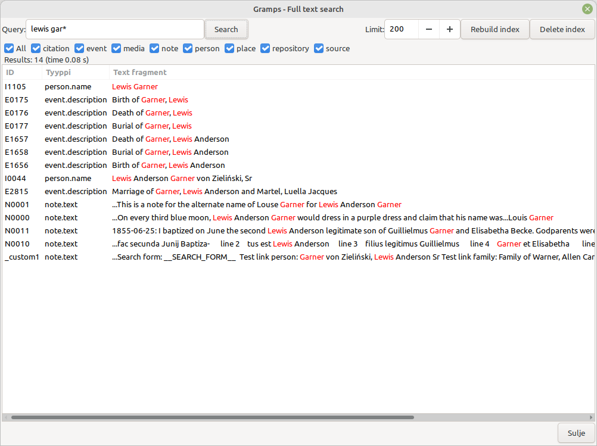
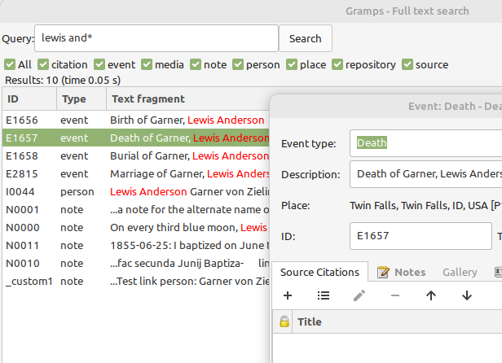

# Full text search
v0.9.0 
14 Jul 2024 
Author: kari.kujansuu@gmail.com 

## Introduction

With this tool you can do fast global searches within a family tree. The search applies to 
- Notes (note text)
- People (names, including alternate names)
- Events (description)
- Places (names, including alternate names)
- Citations (the volume/page field)
- Sources (source title)
- Repositories (name)

The search uses the Whoosh search library (https://whoosh.readthedocs.io) - the same as Gramps Web (https://grampsweb.org). The library code is included with the tool. The tool works only with SQLite databases (i.e. not with the old BSDDB databases).

Before you can search you must create an index which is stored with the family tree in a separate folder. The tool can create the index. The index is automatically updated when the family tree is changed.

## Getting started

The tool is installed by extracting the files under a folder in the "plugins" folder. For example

    $HOME/.gramps/gramps52/plugins/Fulltext
    $HOME/.gramps/gramps52/plugins/Fulltext/fulltext_loader.py
    $HOME/.gramps/gramps52/plugins/Fulltext/fulltext_objects.py
    $HOME/.gramps/gramps52/plugins/Fulltext/fulltext.gpr.py
    $HOME/.gramps/gramps52/plugins/Fulltext/fulltext.glade
    $HOME/.gramps/gramps52/plugins/Fulltext/README.md
    $HOME/.gramps/gramps52/plugins/Fulltext/fulltext_marker.py
    $HOME/.gramps/gramps52/plugins/Fulltext/fulltext.py
    $HOME/.gramps/gramps52/plugins/Fulltext/whoosh/...

Restart Gramps and open a database. The tool is found in the Tools menu under "Experimental tools":

## Creating a search index

When you first start the tool there is no search index yet. The tool will allow you to create the index:

The index creation takes typically under one minute, depending of course of the size of the database:

## Searching

When the index is created the search field appears and you can do searches:

The search term can be:

* one or more words - all must appear in the text
* the words may contain wildcards (* = zero or more letters, ? = exactly one letter)
* phrase search in quotes: "word1 word2"
* phrase search with closeness: "word1 word2"~3 = at most 3 words between word1 and word2
* fuzzy search: append a tilde: word~ matches words that differ by at most one letter from the search word

You can restrict the search by object type or limit the number of search results.

The result list shows fragments of the matching text, for example not the complete note text. The matching words are displayed in red. 

If a person or place has alternate names then all names are displayed separated by slashes.

The list can be sorted by clicking the headers. Double clicking a row opens the corresponding editor, for example:

