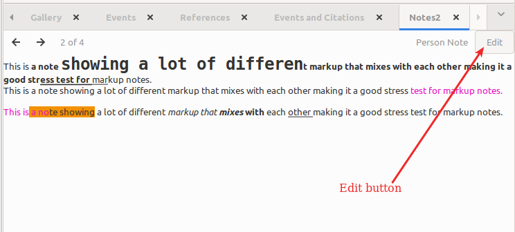

# Notes2 Gramplet
v0.9.0 
3 December 2024 
Author: kari.kujansuu@gmail.com 

This is a slightly modified version of the built-in <a href="https://www.gramps-project.org/wiki/index.php/Gramps_5.2_Wiki_Manual_-_Gramplets#Notes">Notes gramplet</a> found by default at the bottom bar.

The changes are:

1. Potential performance improvement. For some reason, displaying the note is very slow when the note is large (over 100 lines or so). This happens at least on my Linux system. However, I did not notice the slowness on Windows.

2. There is an "Edit" button that allows the user to edit the currently visible note. Or to create a new note if none exist:

