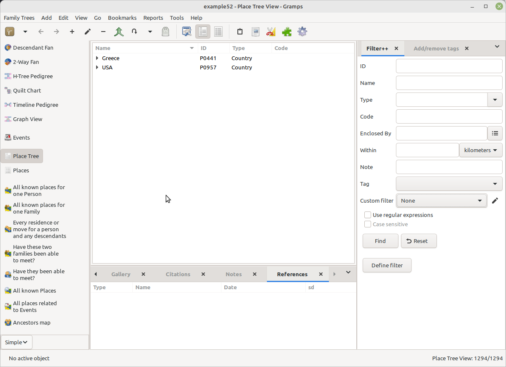
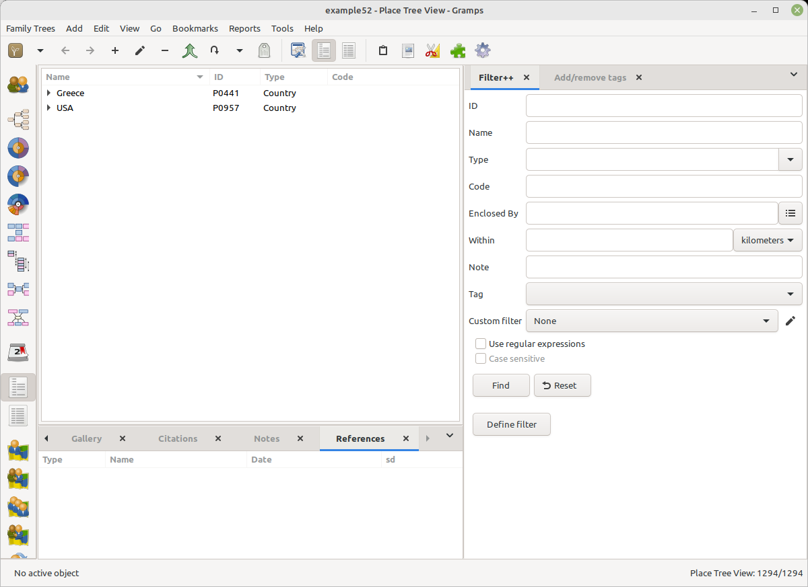

# Simple Sidebar
v1.0 
25 Aug 2024 
Author: kari.kujansuu@gmail.com 

This is an addon that creates a new (left) sidebar for Gramps. The sidebar contains just a flat list of all views for all categories so you can select a view with a single click.

You can activate this sidebar from the bottom left corner:

For clarity, the different categories (Dashboard, People etc) are separated by extra 10 pixel empty space:

This sidebar is probably not so useful if the text labels are not used. With just icons it looks like:

