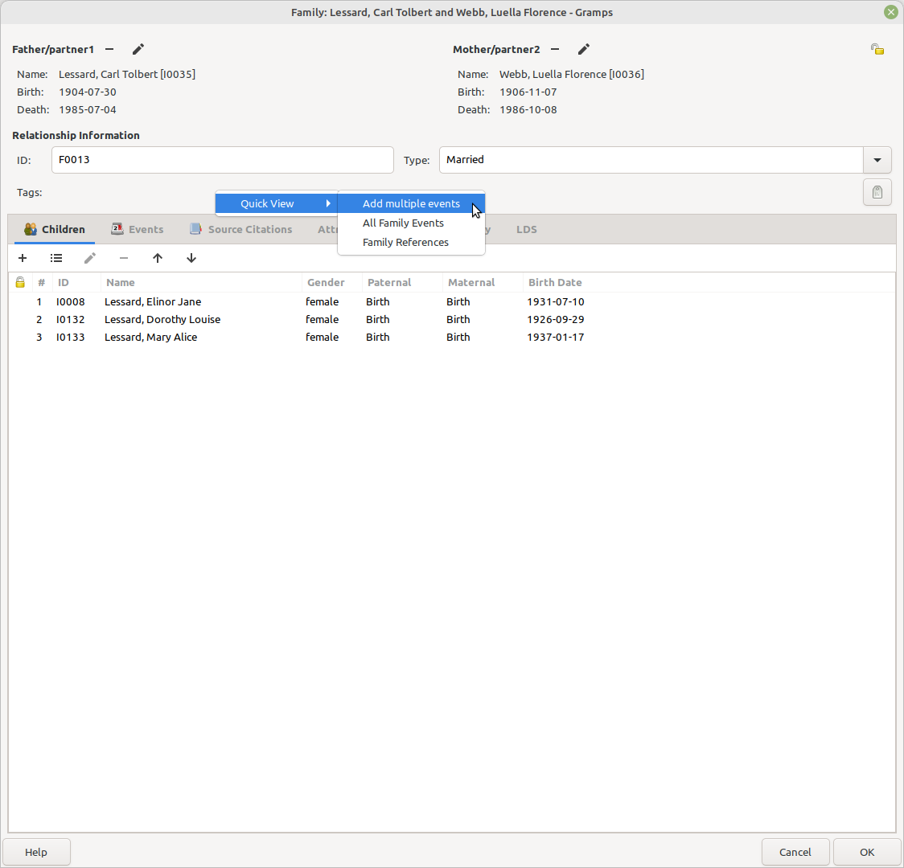
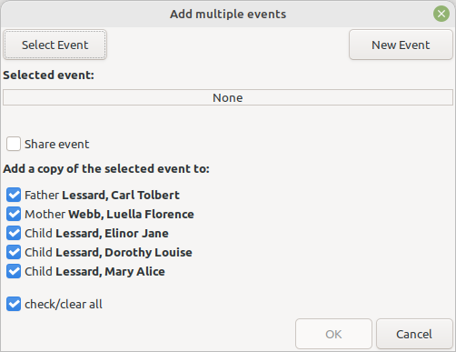
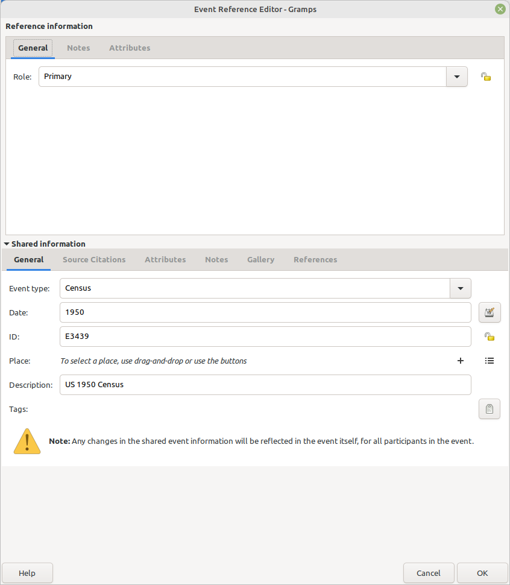
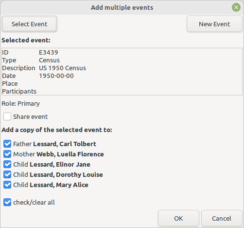
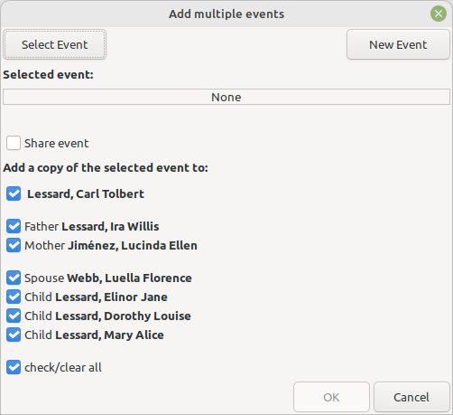

Add multiple events
-------------------
Author: kari.kujansuu@gmail.com 
August 2023 

This addon helps in adding an event to several family members at the same time.

The addon uses the "Quick view" feature for people and families: for example, if you right-click a family and select "Quick View" you get a small popup menu containing a couple of choices. The addon adds a new choice "Add multiple events" to the popup menu. Choosing that will open a dialog allowing you to select an existing event or create a new one. You can specify the family members the event should be added to.

See the following screenshots.

By default, a copy of the the original event is created for each person. This copy contains references to the same notes and citations etc as the original event (i.e. the notes and citations are not copied, only references). Tags and attributes of the original event are not copied to the new events at all.

If you select the "Share event" checkbox then the same event (existing or newly created) is used for all persons. I.e. they would share the same event. This makes sense e.g. for a census event or immigration - but would probably not make sense for a residence event that spans a longer time. This is because the time span would be different for different family members.

The event reference editor is displayed after you select or create the event. This is only used to specify the role for the new event references. If you are selecting an existing event then you should not edit the event part (the lower part) of the dialog - this would change the original event.

Note that if you create a new event and then cancel the operation then a dangling (unreferenced) event will remain in the database. These can be found and removed with the tool "Family Tree Repair > Remove Unused Objects".

Hint: The recently created or modified events can be found in the event selection dialog by clicking twice the header "Last Change".

For a person the Quick View dialog shows the person's parents (if any) and any spouses and children:

