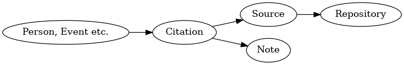
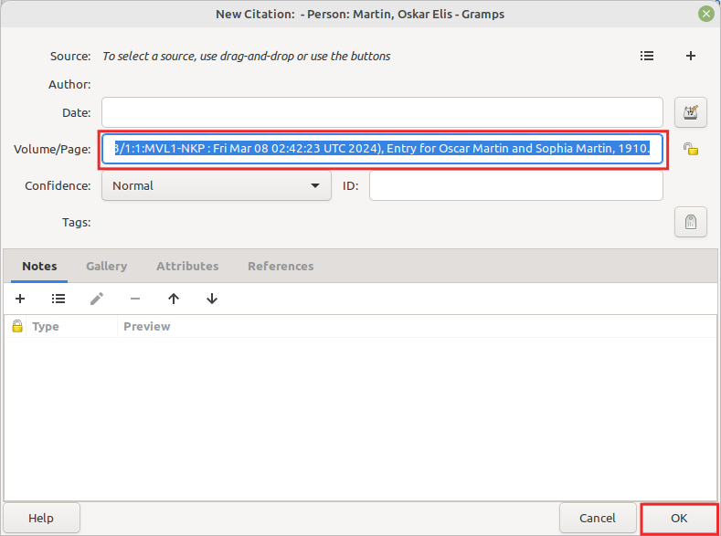

CitationBuilder
---------------

Author: kari.kujansuu@gmail.com 
14 Feb 2025

This addon is experimental and under construction.

This addon tries to make it easier and faster to enter citations in Gramps.

Many online sites provide an automatic citation string. For example, in FamilySearch this page

https://www.familysearch.org/ark:/61903/1:1:MVL1-NK5

contains the citation string

<b>"United States, Census, 1910", , FamilySearch (https://www.familysearch.org/ark:/61903/1:1:MVL1-NKP : Fri Mar 08 02:42:23 UTC 2024), Entry for Oscar Martin and Sophia Martin, 1910.</b>

    
Then it makes sense to create the following objects in Gramps:
    

Object      |Attribute   | Value
------------|------------|----------|
Citation    | page       | Entry for Oscar Martin and Sophia Martin, 1910.
Source      | title      | United States, Census, 1910
Repository  | name       | FamilySearch
Note        | text       | "United States, Census, 1910", , FamilySearch (https://www.familysearch.org/ark:/61903/1:1:MVL1-NKP : Fri Mar 08 02:42:23 UTC 2024), Entry for Oscar Martin and Sophia Martin, 1910.

This addon will automatically create the above items when you just insert the citation string in the Volume/Page field of a new citation and press OK:

Note that this works only if you <b>do not</b> define a Source reference in the citation dialog. The addon will notice that there is no source and then tries to parse the Volume/Page field - it checks whether the citation string matches one of the predefined patterns (the FamilySearch citation string is one of the recognized patterns). If there is a match then the addon proceeds to add the objects.

## Supported citation formats

1. Finnish sites
   1. Digihakemisto
   2. SSHY
   3. Hiski
   4. Katiha
   5. National Library
2. Swedish
   1. Riksarkivet
3. International
   1. FamilySearch
   2. Geni

Possibly more in the future. See below for details.

## Notes

The note is attached to the citation. The note contains the original citation string - in some cases a shorter version. The note usually also contains the date of the citation (i.e. the current date). This is in format "Retrieved dd.mm.yyyy".

A new citation is not created if there is already an identical citation. Likewise, an existing source and repository are used if they exists. The old and new citations are considered identical if the page fields are the same and there is a note whose contents are the same or they both contain the same internet URL. 

The URL comparison is used is because some citation strings contain the date when the citation was obtained (i.e. the current date). Then two citation strings could be otherwise identical but contain different dates. The strings are, however, considered identical if they contain the same URL.

## Supported citation formats

### Digihakemisto

#### Citation string example:

<b>
Antrean seurakunnan arkisto - I C:11 Syntyneiden ja kastettujen luettelot, 1.7.1902 - 1911 1902-1911, jakso 16, sivu 26-27: 1902 marraskuu; Kansallisarkisto: https://astia.narc.fi/uusiastia/viewer/?fileId=9847027858&aineistoId=1201603817 / Viitattu 13.3.2025
</b>

#### Created items:

Object      |Attribute   | Value
------------|------------|----------|
Citation    | page       | jakso 16, sivu 26-27: 1902 marraskuu
Source      | title      | Antrean seurakunnan i C:11 Syntyneiden ja kastettujen luettelot, 1.7.1902 - 1911 1902-1911
Repository  | name       | Antrean seurakunnan arkisto
Note        | text       | Kansallisarkisto: https://astia.narc.fi/uusiastia/viewer/?fileId=9847027858&aineistoId=1201603817 / Retrieved 13.3.2025

***

### SSHY

#### Citation string example:

<b>
Tampereen tuomiokirkkoseurakunta rippikirja 1898-1907 (AP_VI Aa:31)  Sivu 483 Trapp (Wuorio), Trast (Lehto) ; SSHY http://www.sukuhistoria.fi/sshy/sivut/jasenille/paikat.php?bid=31605&pnum=485 / Retrieved 13.03.2025
</b>

#### Created items:

Object      |Attribute   | Value
------------|------------|----------------------------------------------
Citation    | page       | Sivu 483 Trapp (Wuorio), Trast (Lehto)
Source      | title      | Tampereen tuomiokirkkoseurakunta rippikirja 1898-1907 (AP_VI Aa:31)
Repository  | name       | Tampereen tuomiokirkkoseurakunta
Note        | text       | SSHY: http://www.sukuhistoria.fi/sshy/sivut/jasenille/paikat.php?bid=31605&pnum=485 / Retrieved 13.03.2025

***

### Hiski

#### Citation string example:

<b>
https://hiski.genealogia.fi/hiski?se+t1830723
</b>

#### Created items:

Object      |Attribute   | Value
------------|------------|----------------------------------------------
Citation    | page       | https://hiski.genealogia.fi/hiski?se+t1830723
Source      | title      | Ikalis - Ikaalinen HisKi Döpta
Repository  | name       | Hiskipalvelu
Note        | text       | https://hiski.genealogia.fi/hiski?se+t1830723 / Viitattu 29.12.2024

The citation string is just the URL of a record in the Hiski service.  The addon will actually download the page from Hiski and parse the data to find out the correct parish and the type of record. The current date is included in the note.

***

### Katiha

#### Citation string example:

<b>
https://katiha.kansallisarkisto.fi/henkilotieto.php?keyId=0617R006a0000020
</b>

#### Created items:

Object      |Attribute   | Value
------------|------------|----------------------------------------------
Citation    | page       | https://katiha.kansallisarkisto.fi/henkilotieto.php?keyId=0617R006a0000020
Source      | title      | Katiha
Repository  | name       | Kansallisarkisto
Note        | text       | https://katiha.kansallisarkisto.fi/henkilotieto.php?keyId=0617R006a0000020 / Viitattu 30.03.2025

***
### Finnish National Library

#### Citation string example:

<b>
Vasabladet, 18.11.1911, nro 138, s. 4
https://digi.kansalliskirjasto.fi/sanomalehti/binding/1340877?page=4
Kansalliskirjaston Digitoidut aineistot
</b>

#### Created items:

Object      |Attribute   | Value
------------|------------|----------------------------------------------
Citation    | page       | 18.11.1911, nro 138, s. 4
Source      | title      | Vasabladet
Repository  | name       | Kansalliskirjaston Digitoidut aineistot
Note        | text       | Kansalliskirjasto: https://digi.kansalliskirjasto.fi/sanomalehti/binding/1340877?page=4 / Viitattu 30.03.2025

***
### Sweden: Riksarkivet

#### Citation string example:

<b>
Hajoms kyrkoarkiv, Husförhörslängder, SE/GLA/13195/A I/12 (1861-1872), bildid: C0045710_00045
</b>

#### Created items:

Object      |Attribute   | Value
------------|------------|----------------------------------------------
Citation    | page       | SVAR bildid: C0045710_00045
Source      | title      | Hajoms kyrkoarkiv, Husförhörslängder, SE/GLA/13195/A I/12 (1861-1872)
Repository  | name       | Hajoms kyrkoarkiv
Note        | text       | SVAR: https://sok.riksarkivet.se/bildvisning/C0045710_00045 / Viitattu 30.03.2025

***
### FamilySearch

#### Citation string example:

<b>
"United States, Census, 1950", , FamilySearch (https://www.familysearch.org/ark:/61903/1:1:6X1G-K822 : Wed Mar 20 22:12:37 UTC 2024), Entry for Alfred L Kinney and Esther S Kinney, April 8, 1950.
</b>

#### Created items:

Object      |Attribute   | Value
------------|------------|----------------------------------------------
Citation    | page       | Entry for Alfred L Kinney and Esther S Kinney, April 8, 1950.
Source      | title      | United States, Census, 1950
Repository  | name       | FamilySearch
Note        | text       | "United States, Census, 1950", , FamilySearch (https://www.familysearch.org/ark:/61903/1:1:6X1G-K822 : Wed Mar 20 22:12:37 UTC 2024), Entry for Alfred L Kinney and Esther S Kinney, April 8, 1950.

***
### Geni

#### Citation string example:

<b>
https://www.geni.com/people/William-Shakespeare-Bard-of-Avon/6000000003051311313
</b>

#### Created items:

Object      |Attribute   | Value
------------|------------|----------------------------------------------
Citation    | page       | William Shakespeare Bard of Avon
Source      | title      | Geni.com
Repository  | name       | Geni
Note        | text       | https://www.geni.com/people/William-Shakespeare-Bard-of-Avon/6000000003051311313 / Retrieved 30.03.2025

***

## Implementation details

The various citation formats are defined in the module matcher_module.py. If you want to define a new format you can add there a new function with name <code>match_xxxx(citation_string)</code> and put the parse logic there. The function should return a Match object, see the code for details.

It is not required that the citation contains an internet address.

