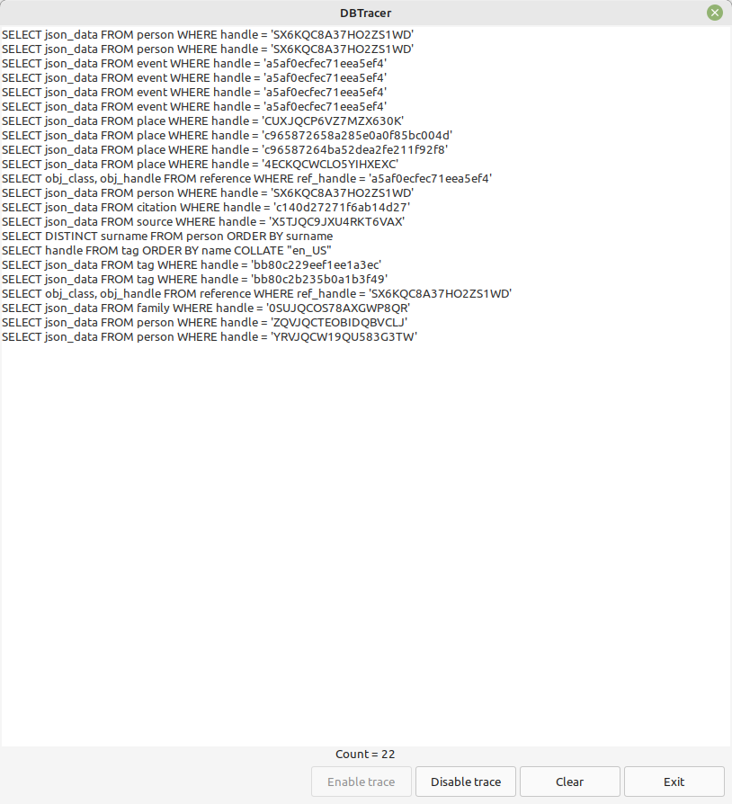

Dbtrace
-------

Author: kari.kujansuu@gmail.com<br>
2025


# General

This addon contains a tool 'DBTracer' that can display in real-time all database operations that Gramps executes. The tool uses the module 'dbtrace' that can also be used by other code, typically other addons.

This might be used for studying the inner workings of Gramps or perhaps helping to investigate a problem. The 'Fulltext search" addon 
(https://github.com/kkujansuu/gramps/tree/master/addons/Fulltext)
uses the 'dbtrace' module to save all database updates to a separate search index.

This works only for SQLite databases.

# The DBTracer tool

The DBTracer tool is installed in the Tools menu under "Experimental tools". When invoked it displays an empty dialog like


Leave the dialog open and do something with Gramps. The dialog will then show the database operations that were executed:



The buttons "Enable trace", "Disable trace" and "Clear" can be used to control tracing.


# The dbtrace module

Usage:


```python
import dbtrace

with dbtrace.tracing(db, callback):
    # do any operations
    ...
    
``` 
The variable 'db' should refer to the current database.

This causes the 'callback' function to be called for all database operations invoked within the 'with' statement. The callback function's argument is the executed SQL statement.

You can also explicity enable and disable tracing:

```python
import dbtrace

def callback(sqlstring):
    # do whatever with sqlstring
    
key = dbtrace.enable_trace(db, callback)
# do any operations
...
dbtrace.disable_trace(db, key)
    
``` 
This causes the 'callback' function to be called for all database operations invoked between enable_trace() and disable_trace(). Enable_trace will return a key value that is supplied to the disable_trace() function.


In this example the callback simply prints all database calls to the console:

```python
import dbtrace
from gramps.gen.lib import Person

def callback(sqlstring):
    print("SQL:", sqlstring)

with dbtrace.tracing(db, callback):
    for person in db.iter_people():
        print(person)

```

The output is something like:


    SQL: SELECT handle, json_data FROM person
    <gramps.gen.lib.person.Person object at 0x7fabbd3ca140>
    <gramps.gen.lib.person.Person object at 0x7fabbd3c8460>
    <gramps.gen.lib.person.Person object at 0x7fabbd3c90c0>
    <gramps.gen.lib.person.Person object at 0x7fabbd3ca350>
    <gramps.gen.lib.person.Person object at 0x7fabbd3ca170>
    ...
    
The first line was output by the callback function.

Database updates would be more interesting:

```python
...
with dbtrace.tracing(db, callback):
    person = db.get_person_from_gramps_id("I0001")
    with DbTxn("Updating a person", db) as trans:
        person.set_gender(Person.FEMALE)
        db.commit_person(person, trans)
```


This one simple update causes 11 database calls (in Gramps 6.0):

    SQL: SELECT json_data FROM person WHERE gramps_id = 'I0001'
    SQL: SELECT 1 FROM person WHERE handle = '66TJQC6CC7ZWL9YZ64'
    SQL: SELECT json_data FROM person WHERE handle = '66TJQC6CC7ZWL9YZ64'
    SQL: UPDATE person SET json_data = '{"handle":"66TJQC6CC7ZWL9YZ64","change":1753882532,"private":false,"tag_list":[],"gramps_id":"I0001","citation_list":["c140d24f0ca2a39a0f1"],"note_list":[],"media_list":[],"event_ref_list":[{"private":false,"citation_list":[],"note_list":[],"attribute_list":[],"ref":"a5af0eb667015e355db","_class":"EventRef","role":{"_class":"EventRoleType","value":1,"string":""}},{"private":false,"citation_list":[],"note_list":[],"attribute_list":[],"ref":"a5af0eb696917232725","_class":"EventRef","role":{"_class":"EventRoleType","value":1,"string":""}}],"attribute_list":[],"address_list":[],"urls":[],"lds_ord_list":[],"primary_name":{"private":false,"surname_list":[{"surname":"Warner","prefix":"","primary":true,"origintype":{"_class":"NameOriginType","value":1,"string":""},"connector":"","_class":"Surname"}],"citation_list":[],"note_list":[],"date":{"format":null,"calendar":0,"modifier":0,"quality":0,"dateval":[0,0,0,false],"text":"","sortval":0,"newyear":0,"_class":"Date"},"first_name":"Sarah Suzanne","suffix":"","title":"","type":{"_class":"NameType","value":2,"string":""},"group_as":"","sort_as":0,"display_as":0,"call":"","nick":"","famnick":"","_class":"Name"},"family_list":[],"parent_family_list":["48TJQCGNNIR5SJRCAK"],"alternate_names":[],"person_ref_list":[],"death_ref_index":-1,"birth_ref_index":0,"commit_ok":true,"my_attribute":"my value","_class":"Person","gender":0}' WHERE handle = '66TJQC6CC7ZWL9YZ64'
    SQL: UPDATE person SET handle = '66TJQC6CC7ZWL9YZ64', gramps_id = 'I0001', gender = 0, death_ref_index = -1, birth_ref_index = 0, change = 1753882532, private = 0, given_name = 'Sarah Suzanne', surname = 'Warner' where handle = '66TJQC6CC7ZWL9YZ64'
    SQL: SELECT ref_class, ref_handle FROM reference WHERE obj_handle = '66TJQC6CC7ZWL9YZ64'
    SQL: DELETE FROM reference WHERE obj_handle = '66TJQC6CC7ZWL9YZ64'
    SQL: INSERT INTO reference (obj_handle, obj_class, ref_handle, ref_class) VALUES('66TJQC6CC7ZWL9YZ64', 'Person', 'a5af0eb696917232725', 'Event')
    SQL: INSERT INTO reference (obj_handle, obj_class, ref_handle, ref_class) VALUES('66TJQC6CC7ZWL9YZ64', 'Person', 'c140d24f0ca2a39a0f1', 'Citation')
    SQL: INSERT INTO reference (obj_handle, obj_class, ref_handle, ref_class) VALUES('66TJQC6CC7ZWL9YZ64', 'Person', '48TJQCGNNIR5SJRCAK', 'Family')
    SQL: INSERT INTO reference (obj_handle, obj_class, ref_handle, ref_class) VALUES('66TJQC6CC7ZWL9YZ64', 'Person', 'a5af0eb667015e355db', 'Event')
    
## Notes

Any exceptions in the callback function cause the callback function to exit immediately but there are no messages. The database operation is still performed normally. Apparently this is how the SQLite driver works by default - i.e. it ignores any exceptions that occur in the callback function. However, you can get traceback error messages if you issue this call:

```python
    import sqlite3
    sqlite3.enable_callback_tracebacks(True)
```
This might be useful when debugging your callback code.

If you install this addon then you should also install the corresponding (or latest) version of the "Fulltext search" addon (if you use it):
https://github.com/kkujansuu/gramps/tree/master/addons/Fulltext. The older version of Fulltext search used its own tracer which is not compatible with this addon.

This addon uses the SQLite feature set_trace_callback (see https://docs.python.org/3/library/sqlite3.html).


