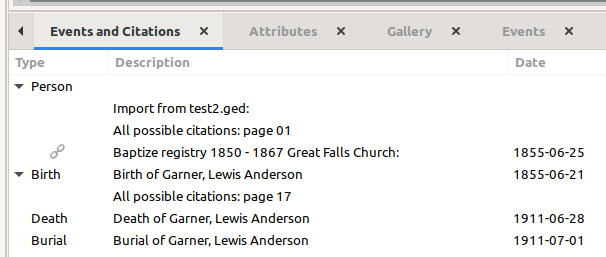
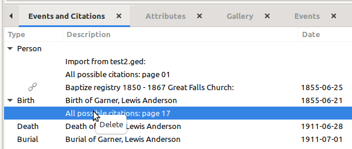
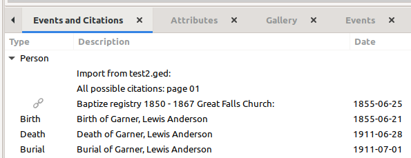
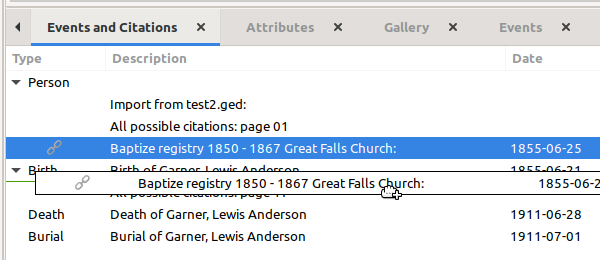
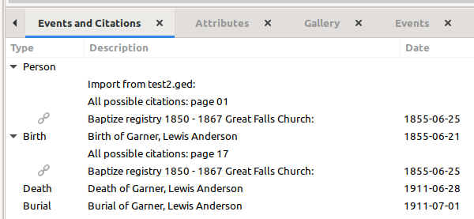
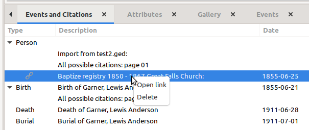
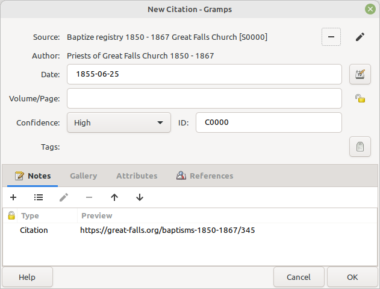
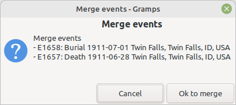

# Events and Citations

Author: kari.kujansuu@gmail.com 
2025

This is a gramplet designed to replace the Events gramplet in the bottom bar for the person view. 

It will show citations attached to the events - and also citations attached directly to the person object.
The intent is to make manipulating citations easier.

It is also easy to see which events do not have citations.

The rows with an event type at the first column  are events. The rows below an event row are citations attached to the event.

There are these additional functionalities within the gramplet:

1. You can delete an event or a citation.

2. You can copy a citation from one event to another.

3. You can open internet links for citations

4. You can merge events.

5. You can drag citations to or from the clipboard.

### 1. Deleting an event or a citation

Right click an event or citation -  a small popup menu is shown:

Click *Delete* and the reference to the citation will be removed:

Note that the citation itself is not deleted, just the reference from the event/person.

### 2. Copying a citation

A citation can be copied from one event to another. In the example the "Baptize registry" citation 
is more appropriate for the birth event than for the person. Move it by simply dragging it to
the correct place:

The citation reference is actually copied, not moved. Therefore the citation remains also in the original place. You can delete it if needed.

### 3. Opening internet links

The gramplet assumes this convention: if an internet link is attached to a citation then the link URL must be in the Volume/page entry for the citation or there must be a note attached to the citation and the note must contain the internet link.

If such a link is found then the small "link" icon is displayed in the first column to the left of the citation. Right click the citation and select "Open link" to open the link in a browser. Only http and https links are supported.

In this example a (fictitious) link is in a note:

The idea to make it quicker to open links - not having to open the citation and the note. It is also easier to see which citations possibly need a link to be supplied.

### 4. Merging events

You can merge two events by  dragging one event and dropping it onto another. Then a dialog is displayed:

This is intended to be used for Residence events (so the example does not make sense). 

The date spans of the events are combined. For example, if the first event is a residence for years 1900-1910 and the other is for 1915 then the resulting event will have a date span of 1900-1915.

### 5. Dragging citations to or from the clipboard

You can also drag citations between the Gramps clipboard and the gramplet.
