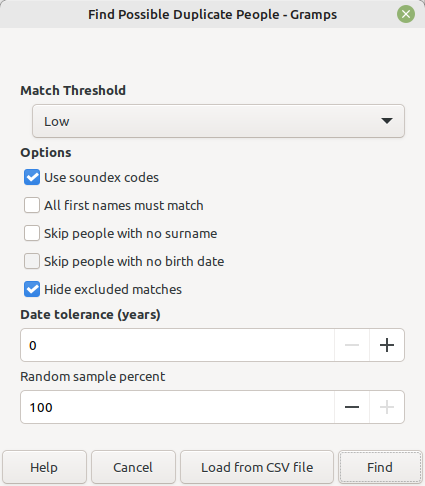
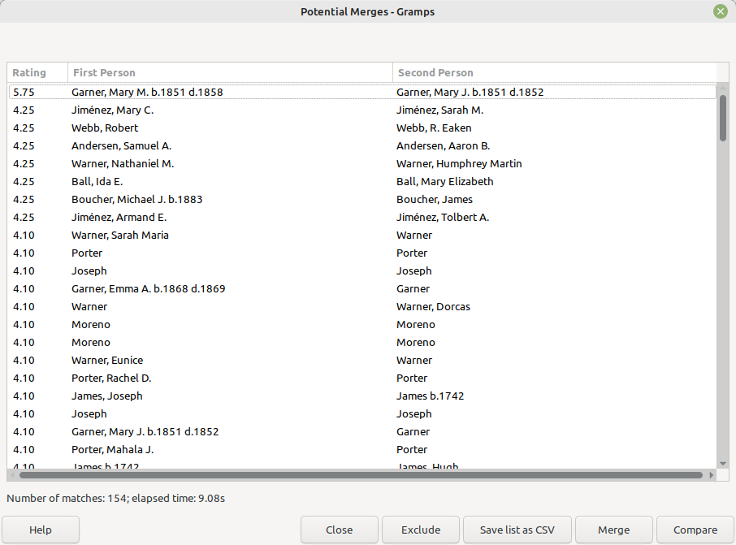
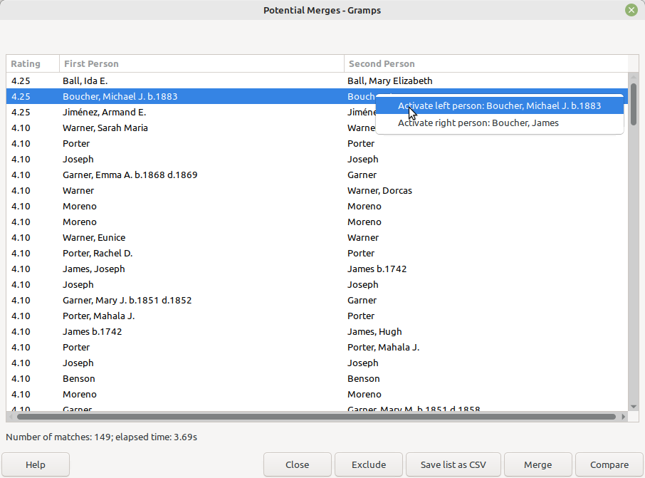
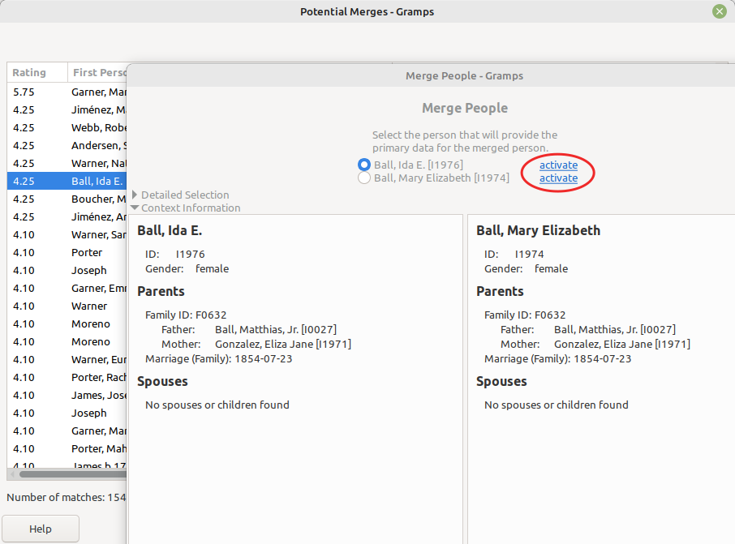

## Find Duplicates 2
kari.kujansuu@gmail.com 
2020-2025

I wrote this a few years ago for the Isotammi project and updated in 2025. It is an enhanced version of the "Find Possible Duplicate People" tool (https://gramps-project.org/wiki/index.php/Gramps_6.0_Wiki_Manual_-_Tools#Find_Possible_Duplicate_People). 

The enhancements are

1. The user can exclude matches that are known to be false matches
1. The user can save the possible duplicates list in a CSV file and reload it later
1. The date comparison works better
1. Merges can be done from the list, also multiple merges at a time
1. Multiple merges are performed under a single transaction
1. New options: 
    1. Skip people with no surnames
    1. Skip people with no birth date
    1. Match all first names
    1. Hide excluded matches
    1. Set date tolerance
    1. Process only a random sample of the database
1. The search operation can be canceled
1. Matching persons can be activated
1. The search is faster because the person objects are cached in memory
1. The birth and death years are displayed
1. Number of matches and elapsed time are displayed
1. The tool closes if the user switches the database
1. The tools can be run from the command line
1. Soundex is not used for non-western names
1. First names with dashes are considered two separate names (so "Mary-Ann" and "Mary Ann" will match)

***

### The search dialog

The tool first displays this dialog which is an expanded version of the original:

**Match Threshold** and **Use soundex codes** are the same as in the original tool.

If **All first names must match** is checked then both matching persons must have at least one given name and the number of given names must be the same and the names should pairwise match each other (possibly using Soundex). The order of names does not matter.

**Skip people with no surname** means that the tool will not consider individuals with no surname.

**Skip people with no birth date** means that the tool will not consider individuals that have no birth event or birth date.

The user can exclude matches that are known to be false matches (see the next screen). However, the excluded matches are shown if **Hide excluded matches** is unchecked. 

Normally matches must have the same year of birth (if they both have birth dates). However, with **Date tolerance** the user can relax this to allow matches where birth years differ by the given number. This is meant for cases where the birth year is estimated. 

**Process only a random sample of the database** means that the tool only processes a random part of inidividuals in the database. This is intended for cases when there is a large database and running a complete report would take a long time, However, using the CSV feature might also help in such a case. See next section.

With **Load from CSV file** the user can load the search results from an earlier run where the match list is stored in a CSV file. The tool will then immediately load the earlier match list without doing a new search. Any excluded matches are not loaded.

### The match list

The match list screen looks like similar to the original version:

The new functions are:

The matches with the highest ratings are displayed first.

The birth and death years of matching people are displayed. This should help in identifying them.

The **Exclude** button: click this if the selected matches are known to be false matches and they are removed from the list. The exclusions also stored permanently in a separate database so they will not be seen in the future unless **Hide excluded matches** is unchecked in the search dialog. There is no way to undo the exclude setting.

**Save list as CSV** saves the current match list in a CSV file. The user must specify the name and location of the CSV file. The excluded matches are not saved. The user can then later, in a future run, reload the list from the CSV. This is meant for cases where the match list generation takes a long time and the user will perform the merges across several sessions.

The **Merge** button will immediately merge the selected matches. The first person (on the left) will always be selected as the primary person.

The **Compare** button will invoke a merge dialog for the selected match (as in the original tool).

The user can activate any of the displayed persons from this screen by right-clicking a row and selecting either person:

For example the Relationships view will then be updated accordingly so it is easier to evaluate the match.

### The compare dialog

The compare dialog looks similar to the original version but the user can also activate either of the matches from this dialog:

