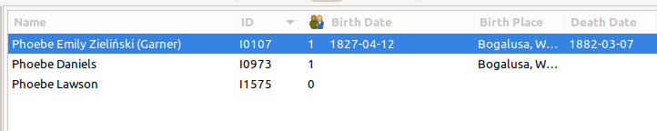
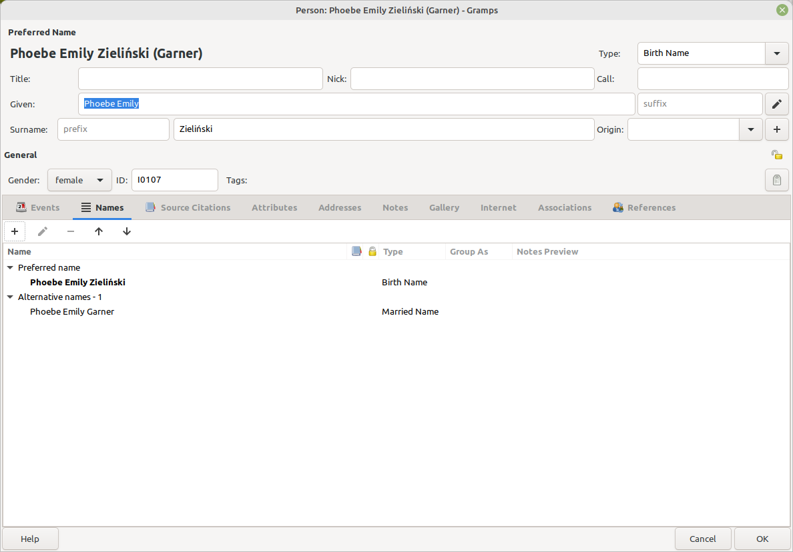

# Name Format
v0.9.1 
31 Mar 2025 
Author: kari.kujansuu@gmail.com 

	This addon should now support both Gramps 5.x and Gramps 6.0.

Often it would be useful that a person's name includes both the birth surname and a married surname. In gramps you can define multiple names for a person but only one of them - the primary name - is used when the person is displayed for example in the person list view or charts etc.

This addon patches some Gramps internal classes so the that a person's display name contains also the surnames defined in alternate names.

For example, consider a person with

    Primary name (type MARRIED):
      First name: Mary 
      Last name:  Smith
    Alternate name (type BIRTH):
      First name: Mary 
      Last name:  Jones

Normally her display name is derived from the primary name only. It could be for example "Mary Smith". 

When this addon is installed then her name is displayed as "Mary Smith (Jones)" - the alternate surname is added at the end of the name in parentheses. This is not possible in regular Gramps.

If a person does not have alternate names (or the alternate names do not contain surnames) then the display name is not changed.

If there are multiple alternate names then all the surnames are listed separated by commas, for example "Mary Smith (Jones, Hill).

If the name format set in Gramps preferences is e.g. "Surname, Given" then the alternate names are still appended at the end: "Smith, Mary (Jones)".

The given names (or other parts) in alternate names are not used.

However, this does not affect all places in Gramps where names are displayed. At least some reports seem to use their own way to display names.

The new format name is not stored in the database. The new names are generated at runtime. If this addon is removed then the original name format will again be used.

Here is an example from the sample database. Phoebe Zieliński's married name is Garner and it is displayed in the list view
and at the top of the person dialog. This could help in identifying a correct person in a list:

