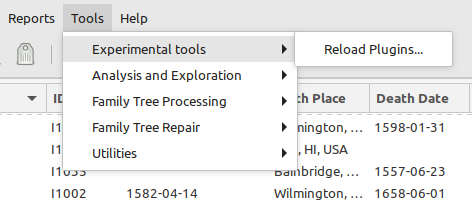

# Reload Plugins Tool 
v0.9.0 
20 July 2024 
Author: kari.kujansuu@gmail.com 

This is a simple tool that reloads the code for all plugins from disk without restarting Gramps. There is no user interface, just start the tool and it will perform the reloads. As a confirmation the message 'Plugins reloaded' will be shown briefly on the status line.

After installation the tool is found in the "Experimental tools" submenu under the Tools main menu:

The tool is especially useful if you are developing a new tool and need to frequently start it to test its behaviour after modifications. In that case you could also use the "Tool Launcher" gramplet (https://github.com/kkujansuu/gramps/tree/master/addons/tool-launcher):

Note that code reloading works best for TOOL type of plugins. When a tool is started it usually picks up the updated code and uses it. However, for some tools the code may be permanently loaded in memory and updating requires restarting Gramps.

For gramplets to use the reloaded code the gramplet must be removed for a sidebar (for example) and re-added there. So it is usually easier to just stop and restart Gramps.
