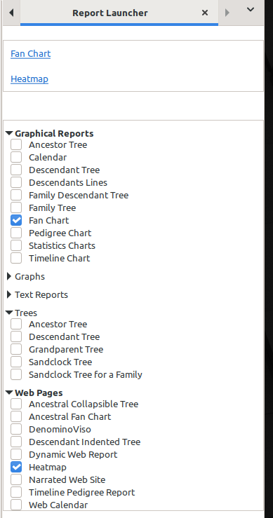

# Report Launcher
v0.9.0 
8 June 2025 
Author: kari.kujansuu@gmail.com 

This gramplet makes it easy to run frequently used reports with one click. It is similar to Tool Launcher  (https://github.com/kkujansuu/gramps/tree/master/addons/tool-launcher).

Install the gramplet in a sidebar (in any category) and then you can select which reports are visible as clickable links:

The top part of the gramplet shows the selected reports as clickable links.

The bottom parts contains all report categories. You can open and close the categories and use the checkboxes to select which reports are shown in the top part.

