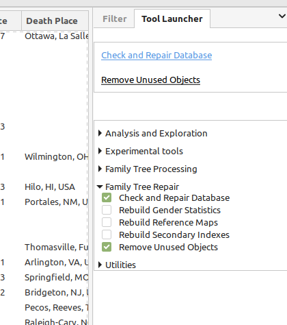
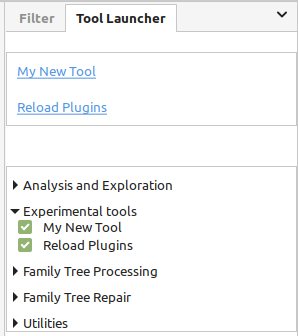
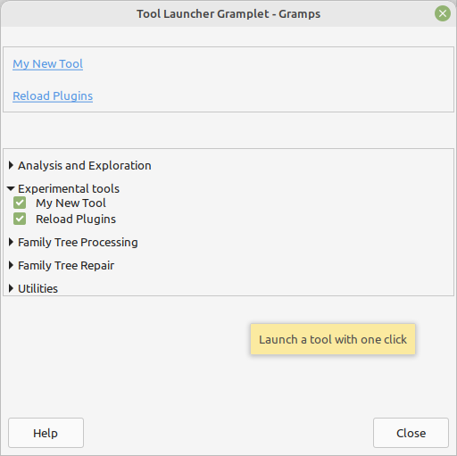

# Tool Launcher
v0.9.0 
5 Aug 2024 
Author: kari.kujansuu@gmail.com 

This gramplet makes it easy to run frequently used tools with one click. Install the gramplet in a sidebar (in any category) and then you can select which tools should be visible as clickable links:

The top part of the gramplet shows the selected tools as clickable links.

The bottom parts contains all tool categories. You can open and close the categories and use the checkboxes to select which tools are shown in the top part.

The gramplet is especially useful if you are developing a new tool and need to frequently start it to test its behaviour after modifications. In that case you should also use the "Reload plugins" tool (https://github.com/kkujansuu/gramps/tree/master/addons/reload_plugins) which reloads a new version of the tool code from disk:

Of course, the gramplet can also be detached from the sidebar (as all gramplets) and then it is available in all categories:

